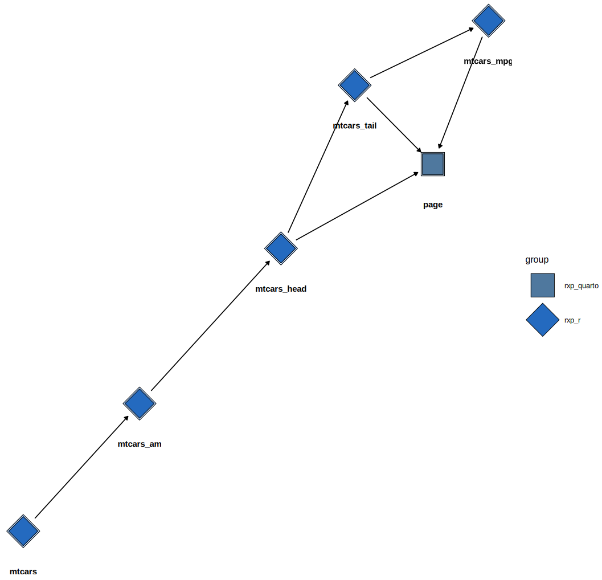

# rixpress: Reproducible Analytical Pipelines with Nix

This package provides a framework for building reproducible analytical pipelines
using Nix, heavily inspired by the R package `targets`. It leverages the `rix`
package to generate a `default.nix` file, ensuring the pipeline runs in a fully
reproducible Nix-managed environment. The pipeline itself is defined in a
`pipeline.nix` file, which is automatically generated based on simple R
declarations. Concretely, `{rix}` made using Nix as a package manager easier
for R users, `{rixpress}` makes it now easy to use Nix as a build automation tool
for R users!

For example this R script:

```{r, eval = FALSE}
library(rixpress)

d0 <- rxp_file(mtcars, 'mtcars.csv', \(x) (read.csv(file = x, sep = "|")))
d1 <- rxp_r(mtcars_am, filter(mtcars, am == 1))
d2 <- rxp_r(mtcars_head, head(mtcars_am))
d3 <- rxp_r(mtcars_tail, tail(mtcars_head))
d4 <- rxp_r(mtcars_mpg, select(mtcars_tail, mpg))
doc <- rxp_quarto(page, "page.qmd")

rxp_list <- list(d0, d1, d2, d3, d4, doc)

rixpress(rxp_list)

rxp_make()
```

This workflow generates a `pipeline.nix` file, assuming a `default.nix` is
already available to define the environment. Each output (e.g., `mtcars`,
`mtcars_am`, `mtcars_head`, `mtcars_tail`, `mtcars_mpg`, `page`) is built by Nix
within this environment.

When you run `rixpress(rxp_list)`, it creates `pipeline.nix` and a `_rixpress/`
folder containing a JSON representation of the pipeline’s DAG (Directed Acyclic
Graph). You can visualize the pipeline using `plot_dag()`:

```{r, eval = FALSE}
plot_dag()
```




You can read outputs with `rxp_read("mtcars_mpg")` or load them into the global
environment with `rxp_load("mtcars_mpg")`. For complex outputs such as documents,
(for example the Quarto document defined above, called `page`, `rxp_read("page")`
returns its file path, which you can open with `browseURL("path/to/page")`.

## Purpose

The goal is to create data analysis pipelines that are:

- **Fully Reproducible:** Work the same way across machines and over time.
- **Multi-Language:** Allow steps in R, Python (planned), or other languages supported by Nix.
- **Inspired by targets:** Mimic its dependency tracking and task orchestration, enhanced by Nix’s deterministic builds.

By combining Nix’s reproducibility with a targets-like structure, you can
rebuild every step of your analysis—data processing, modeling, reporting—exactly
as intended, even years later or on different systems (as long as the sources
stay available or the systems are supported by Nix of course).

## How It Works

### Environment Setup with `default.nix`

- The `rix` package creates a `default.nix` file specifying your software
  environment (e.g., R version, packages).
- `{rixpress}` generates a `pipeline.nix` which builds a (potentially) polyglott
  data science project using Nix as the build automation tool.
- The `default.nix` generated by `{rix}` is used to provide the right environment
  to the pipeline.

### Pipeline Definition
- Define steps (derivations) in a `pipeline.nix` file, which can use R or
  other languages.
- Each derivation produces outputs like datasets or reports.

### Dependency Graph
- A `dag.json` file maps out the relationships between derivations.
- R scripts process this JSON to add correct dependency loading to `pipeline.nix`.

### Building the Pipeline
- Run `rxp_make()` to execute the pipeline, storing outputs in the Nix store 
  (e.g., `/nix/store/...`).
- Easily recover the outputs in your current R session using `rxp_read()` and
  `rxp_lead()`.

## Key Advantages of Using Nix

- **Complete Reproducibility:** Pins all dependencies to exact versions.
- **Multi-Language Support:** Unlike `targets`, it’s not limited to R.
- **Isolation:** Each step runs in a sandbox, avoiding system interference.
- **Portability:** Share your Nix files, and anyone with Nix can rebuild your work.

## Inspiration from `targets`

This package borrows from `targets`:

- **Dependency Tracking:** Ensures steps only rerun when inputs change.
- **Modularity:** Breaks workflows into reusable steps.
- **Automation:** Executes tasks in the right order.

Nix extends these ideas beyond R into a cross-language, reproducible framework.

## Installation

### Prerequisites

#### Install Nix
tbd

#### Install R
tbd

### Install from GitHub

To install this package directly from GitHub, use the `remotes` R package:

```r
# Install remotes if you don’t have it
if (!require("remotes")) install.packages("remotes")

# Install the package from GitHub
remotes::install_github("b-rodrigues/rixpress")
```

## Usage Example

### Define Your Pipeline in R

```r
# Create derivations
d1 <- rxp_r(mtcars_am, filter(mtcars, am == 1))
d2 <- rxp_r(mtcars_head, head(mtcars_am))

# Collect into a list
rxp_list <- list(d1, d2)

# Save or process further (e.g., generate pipeline.nix and dag.json)
```

### Build the Pipeline

Generate `pipeline.nix` and `dag.json` using provided scripts (e.g., `generate_dag.R`, `postprocess_nix.R`). Then run:

```{r, eval = FALSE}
rxp_make()
```

This builds all derivations, producing outputs in the Nix store.

## Contributing

TBD

